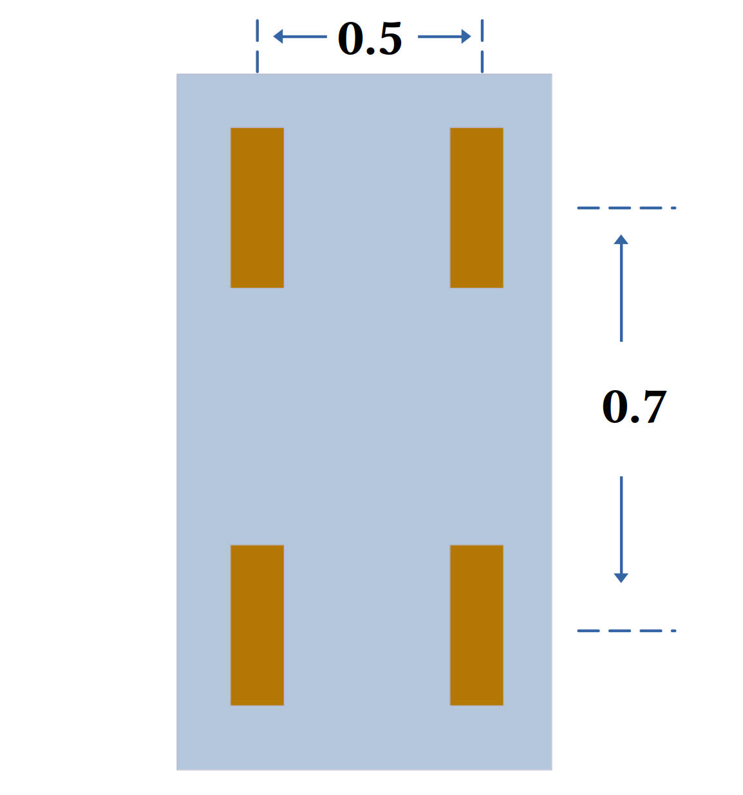

# Model
Differential drive model

|parameter|symbol|value|unit|
|---|---|---|---|
|wheel radius|$r$|$0.15$|meter|
|distance between wheels|$D$|$0.5$|meter|
|x position in world frame|$x$||meter|
|y position in world frame|$y$||meter|
|orientation in world frame|$\theta$||radian|
|angular velocity of left wheel|$\omega_l$||radian/second|
|angular velocity of right wheel|$\omega_r$||radian/second|
|linear velocity of left wheel|$v_l$||meter/second|
|linear velocity of right wheel|$v_r$||meter/second|
|forward velocity|$v$||meter/second|
|angular velocity|$w$||radian/second|

# Kinematics
$$
\begin{bmatrix}
\dot{x}  \\
\dot{y}  \\
\dot{\theta} \\
\end{bmatrix}
=
\begin{bmatrix}
    cos\theta & 0  \\
    sin\theta & 0  \\
    0 & 1 \\
\end{bmatrix}
\begin{bmatrix}
    v  \\
    w
\end{bmatrix}
$$
where we have
$$
\begin{bmatrix}
    v  \\
    w
\end{bmatrix}
=
\begin{bmatrix}
    \frac{r}{2} & \frac{r}{2}  \\
    -\frac{r}{D} & \frac{r}{D}  \\
\end{bmatrix}
\begin{bmatrix}
    \omega_l  \\
    \omega_r
\end{bmatrix}
=
\begin{bmatrix}
    \frac{1}{2} & \frac{1}{2}  \\
    -\frac{1}{D} & \frac{1}{D}  \\
\end{bmatrix}
\begin{bmatrix}
    v_l  \\
    v_r
\end{bmatrix}
$$
$$
\begin{bmatrix}
    \omega_l  \\
    \omega_r
\end{bmatrix}
=
\begin{bmatrix}
    \frac{1}{r} & -\frac{D}{2r}  \\
    \frac{1}{r} & \frac{D}{2r}  \\
\end{bmatrix}
\begin{bmatrix}
    v  \\
    w
\end{bmatrix}
$$
$$
\begin{bmatrix}
    v_l  \\
    v_r
\end{bmatrix}
=
\begin{bmatrix}
    1 & -\frac{D}{2}  \\
    1 & \frac{D}{2}  \\
\end{bmatrix}
\begin{bmatrix}
    v  \\
    w
\end{bmatrix}
$$