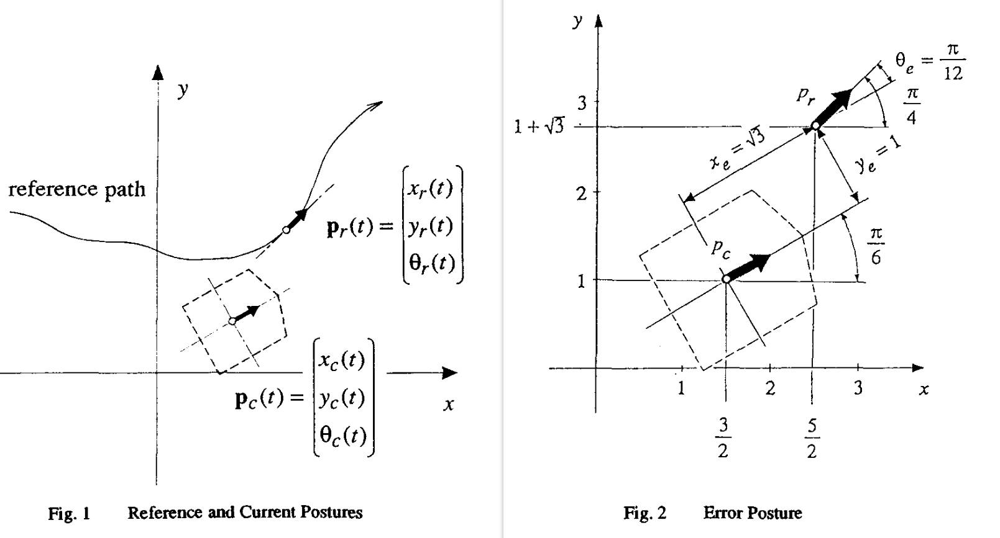

# Introduction
Lyapunov function method

# Kinematics Model
Refer to [Kinematics_model.md](../Kinematics_model.md)

# Controller

## Error system

From the [reference](./robot.1990.126006.pdf), we have the error system in the body frame

$$
\begin{bmatrix}
{x}_e  \\
{y}_e  \\
{\theta}_e \\
\end{bmatrix}
=
\begin{bmatrix}
    \cos\theta_c & \sin\theta_c  & 0  \\
    -\sin\theta_c & \cos\theta_c & 0  \\
    0 & 0 & 1 \\
\end{bmatrix}
(p_r-p_c)
$$

which indicates that
$$
\begin{bmatrix}
\dot{x}_e  \\
\dot{y}_e  \\
\dot{\theta}_e \\
\end{bmatrix}
=
\begin{bmatrix}
y_ew-v+v_r\cos\theta_e  \\
-x_ew+v_r\sin\theta_e  \\
w_r-w \\
\end{bmatrix}
$$

then the stable controller 
$$ 
\begin{bmatrix}
v \\
w  \\
\end{bmatrix}
=
\begin{bmatrix}
v_r\cos\theta_e + k_x^px_e \\
w_r+v_r(k_y^py_e+k_{\theta}^p\sin\theta_e ) \\
\end{bmatrix}
$$
and lyapunov function
$$
V = \frac{1}{2}(
x_e^2 + y_e^2 )+ \frac{1-\cos\theta_e}{k_y^p}
$$
can be given.

# Reference
- [A Stable Tracking Control Method 
for an Autonomous Mobile Robot ](./robot.1990.126006.pdf)

- M. Vidyasagar, "Nonlinear Systems Analysis", Prentice-Hall Inc. Englewood
Cliffs, N.J., 1978