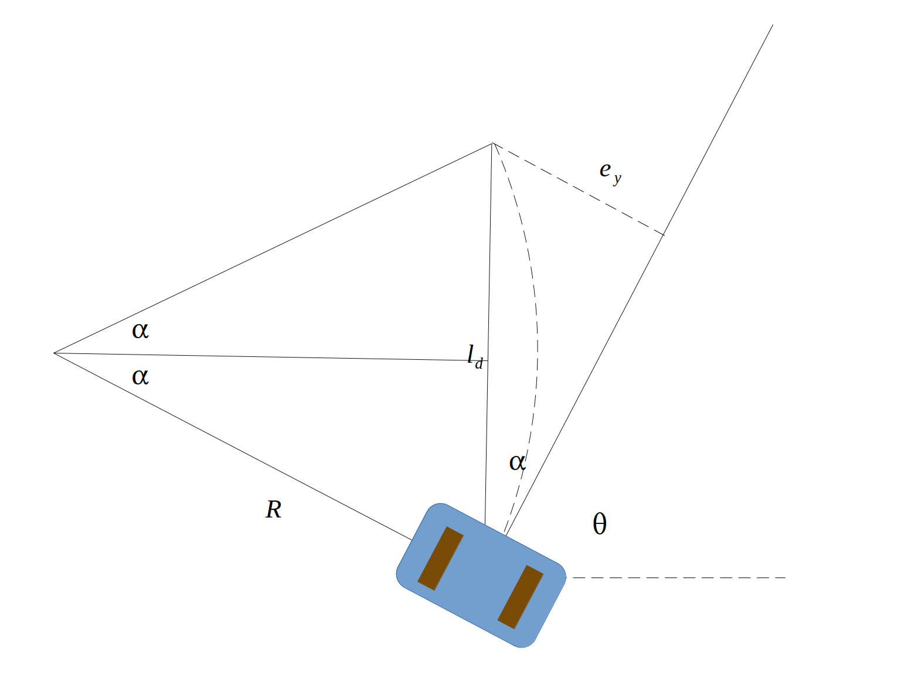

# Introduction
Pure pursuit method

# Geometry Model

This method focus on the rear wheel of the vehicle.

|parameter|symbol|value|unit|
|---|---|---|---|
|orientation in world frame|$\theta$||radian|
|error y in body frame|$e_y$||meter|
|target distance|$l_d$||meter|
|circumradius|$R$||meter|
|angular velocity|$w$||radian/second|
|linear velocity|$v$||meter/second|

From
$$
\sin\alpha=\frac{\frac{l_d}{2}}{R}
$$
we can get
$$
R = \frac{l_d}{2\sin\alpha}
$$
since we have
$$
v=Rw
$$
then we can get
$$
w=\frac{v}{R} = \frac{2v\sin\alpha}{l_d}
$$
from the geometry model, we note that
$$
\sin\alpha = \frac{e_y}{l_d}
$$
then we can get
$$
w=\frac{v}{R} = \frac{2v\sin\alpha}{l_d} = \frac{2v e_y}{l_d^2}
$$
where $v$ is the linear velocity of the vehicle, which is manually set by the planner.

# Note
- adjust the angular velocity $w$ in the next command frame according to the error $e_y$ in the body frame.